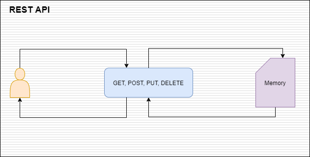

## A gorilla to-do rest api using TDD and Go tests best pratices
This is a simple rest api that implements a todo application. It uses [gorilla-mux](https://github.com/gorilla/mux) to create the routes, and **TDD** and **Test Table Driven**. **Gorilla-mux** and http standard library from Go are good combination to build microservices. They are small, and produces efficient executables.

* **Gorilla-mux** \
[Gorilla-mux](https://github.com/gorilla/mux) is a library used to implement requests and dispatcher, for matching incoming resquests.
```go
subroute.HandleFunc("/items/{id:[0-9]+}", findItem).Methods("GET")
```


* **Golang Test Table Driven pattern** \
This pattern allow us to build tests that are reusable. We may test many scenarios in the same test.
```go
func TestFindToDoItem(t *testing.T) {
	setup()
	type args struct {
		id int
	}
	tests := []struct {
		name string
		args args
		want *ToDoItem
	}{
		{"FindToDoItem A", args{id: 1}, NewToDoItem(1, "A")},
		{"FindToDoItem B", args{id: 0}, &ToDoItem{}},
	}
	for _, tt := range tests {
		t.Run(tt.name, func(t *testing.T) {
			if got := FindToDoItem(tt.args.id); !reflect.DeepEqual(got, tt.want) {
				t.Errorf("FindToDoItem() = %v, want %v", got, tt.want)
			}
		})
	}
	tearDown()
}
```

* **Design**

<p align="center">
    
</p>

* **Build** \
In project root folder type `go build -v`

* **Test** \
In project root folder type `go test ./... -v`

* **Using curl to work with the api**
```shell
$ curl -i http://localhost:8080/api/items/3
HTTP/1.1 200 OK
Date: Sun, 09 Aug 2020 14:07:19 GMT
Content-Length: 25
Content-Type: text/plain; charset=utf-8

{"id":3,"description":"have a breakfast at 08:00"}
```